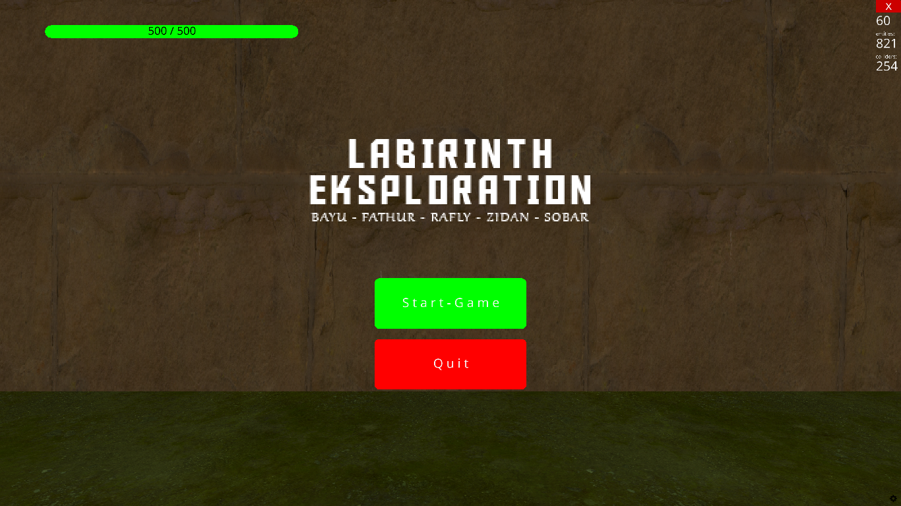
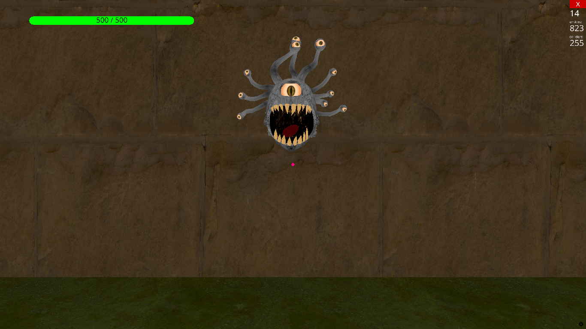
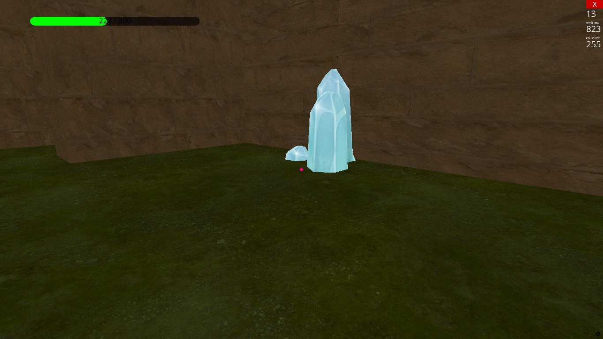

# Labirinth Exploration Game — Release v1.0

Release date: 2026-03-08

## What's included
- Windows build (packaged executable) located inside the zip: `labirinth-exploration-game.exe` and its required files.
- All game assets under `assets/` bundled with the release.

## Changelog
- Initial playable release: gameplay loop, labirinth map, basic monster, health bar, collectible items, and UI.

## How to run
1. Download and extract the zip release.
2. Open the extracted folder and double-click `labirinth-exploration-game.exe` (no Python required).

If your OS blocks running the file, allow execution in your system security settings or right-click → "Run as administrator".

## Files to share
*Google Drive (placeholder)*
Download from: https://drive.google.com/file/d/1VTXRFFgoBjYuxSHmARByJB0EGr733m9q/view?usp=sharing

Replace the link above with your actual Google Drive shared link before publishing.

---
If you want, I can also prepare a GitHub release draft and attach the zip automatically (requires GitHub authorization).

## Screenshots
Preview screenshots from the release (see `assets/screenshots/`):

